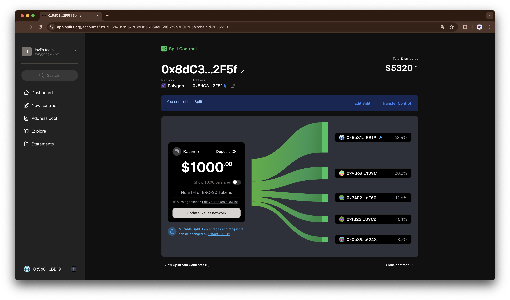

# ethglobal-sf-2024

> [!NOTE]
> This project was created during the
> [`ETHGlobal SF 2024`](https://ethglobal.com/events/sanfrancisco2024)
> hackathon.

**AutoRF** is [retro funding](https://retrofunding.optimism.io) made simple.
Project impact metrics are regularly indexed, which is used to configure
on-chain [splits](https://splits.org) contracts to reward projects over regular
settlement periods. We launched “The Grinder’s Fund”, to reward the hardest
working projects at
[ETHGlobal SF](https://ethglobal.com/events/sanfrancisco2024).

## How it's made

The application consists of 4 major components:

- Web Application
- AutoRF SDK
- Server-side Cron Jobs
- OnChain Funding Contracts

### Web Application

The application is built with Next.js and Supabase. Users authenticate via
GitHub OAuth, which allows them to verify their permissions for committing to
repositories.

Within the app, users can manage funding pools by creating new ones, editing
existing ones, or joining current pools to track their progress.

We also implemented a referral link system to facilitate project promotion and
increase sign-ups for funding pools.

### AutoRF SDK

We created a [JavaScript package](./packages/sdk/) to handle tasks related to
funding pools, such as:

- Minting project registration attestations on-chain with the
  [Sign protocol](https://docs.sign.global)
- Gathering data needed to calculate a project's impact metrics
- Creating a funding pool using [0xSplits](https://splits.org) contracts
- Setting the split contract weights based on project impact
- Allowing funding distribution for a specific period

### Server-side Cron Jobs

We have a server-side cron job that runs every week to calculate the impact
metrics of each project, using our SDK. The metrics are then used to update the
split contract weights for each project in the funding pool.

### OnChain Funding Contracts

We use 0xSplits contracts for funds custody and distribution. We plan to support
other money streaming protocols in the future, such as `Drips` and `Superfluid`.

